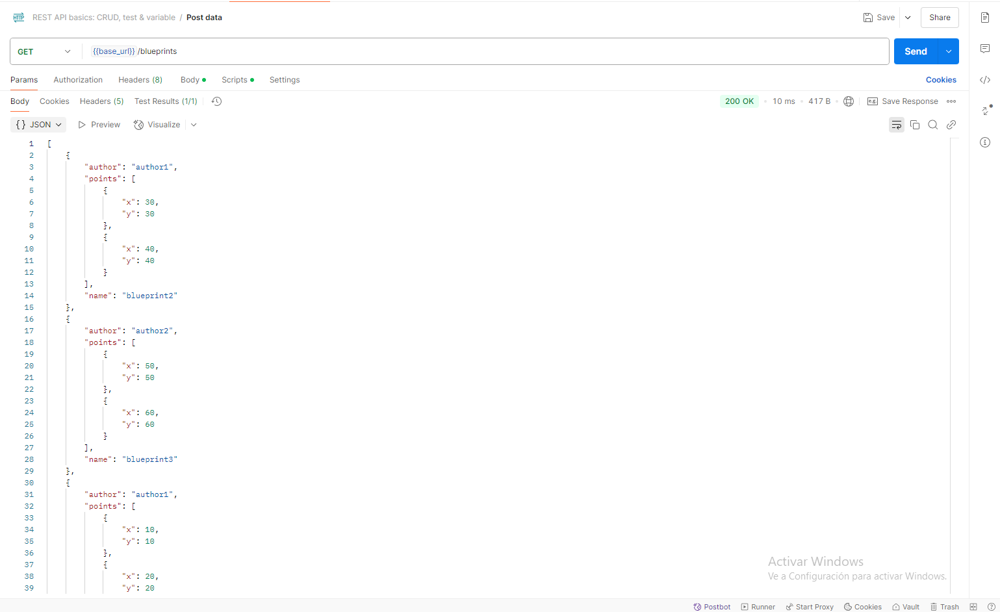
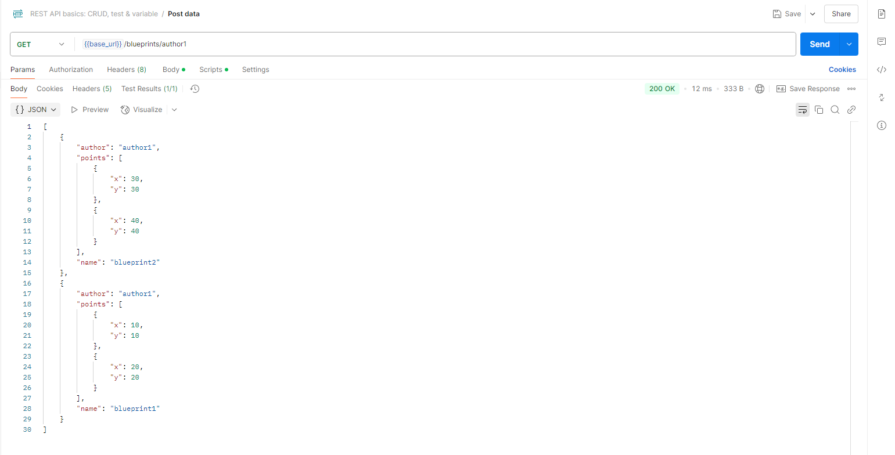
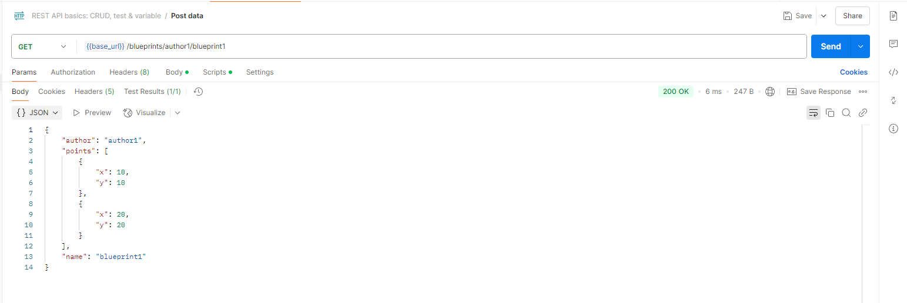
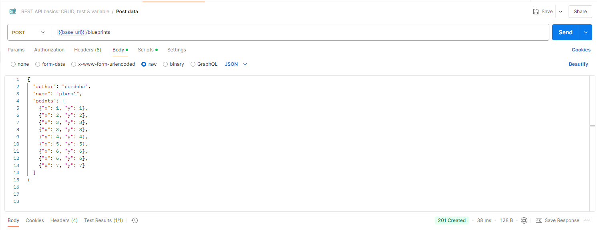
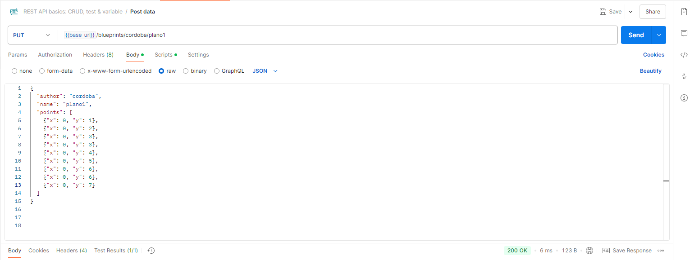
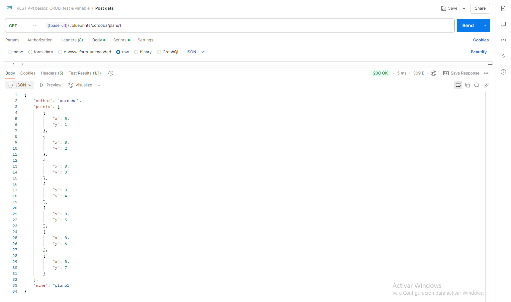

# Lab05-ARSW

### Hecho por:
- Santiago Córdoba Dueñas
- Santiago Silva Roa

## Parte 1
2. Se modifico el siguiente metodo para poder inicializar la API con 3 planos:

```java
public InMemoryBlueprintPersistence() {
    Point[] points1 = {new Point(10, 10), new Point(20, 20)};
    Blueprint bp1 = new Blueprint("author1", "blueprint1", points1);

    Point[] points2 = {new Point(30, 30), new Point(40, 40)};
    Blueprint bp2 = new Blueprint("author1", "blueprint2", points2);

    Point[] points3 = {new Point(50, 50), new Point(60, 60)};
    Blueprint bp3 = new Blueprint("author2", "blueprint3", points3);

    blueprints.put("author1_blueprint1", bp1);
    blueprints.put("author1_blueprint2", bp2);
    blueprints.put("author2_blueprint3", bp3);
}
```
3. Se coloco el siguiente controlador para poder hacer la petición GET correspondiente:

```java
@RestController
@RequestMapping("/blueprints")
public class BlueprintsController {

    @GetMapping
    public ResponseEntity<?> getAllBlueprints() throws BlueprintPersistenceException {
        Set<Blueprint> blueprints = blueprintServices.getAllBlueprints();
        if (blueprints == null || blueprints.isEmpty()) {
            return ResponseEntity.noContent().build();
        }
        return ResponseEntity.ok(blueprints);
    }
```

4. Aca se puede evidenciar una prueba al consumir el respectivo endpoint, para poder obtener todos los planos:



5. Evidencia del correcto funcionamiento del endpoint, para poder obtener todos los planos de un autor:



6. Se muestra el funcionamiento de manera correcta del endpoint, con el fin de obtener un plano en especifico de un autor en especifico:



## Parte 2

1. Se añade el controlador correspondiente para poder hacer la petición y crear nuevos planos:

```java
@PostMapping
    public ResponseEntity<?> addNewBlueprint(@RequestBody Blueprint blueprint) {
        try {
            blueprintServices.addNewBlueprint(blueprint);
            return ResponseEntity.status(201).build();
        } catch (Exception e) {
            return ResponseEntity.badRequest().body("Error al agregar el blueprint: " + e.getMessage());
        }
    }
```

2. Se hace la respectiva prueba para evidenciar el funcionamiento del endpoint (se hace con postman en vez de curl):



3. Se prueba que al hacer la petición GET blueprints/{author}/{bpname} se obtenga el plano que se acabo de añadir:


4. Se añade el servicio, el metodo en la persistencia y el controlador de la petición PUT para poder actualizar los planos:

```java
//Persistence
@Override
    public void updateBlueprint(String author, String name, Blueprint updatedBlueprint) throws BlueprintNotFoundException {
        rwLock.writeLock().lock();
        try {
            String key = author + "_" + name;
            if (!blueprints.containsKey(key)) {
                throw new BlueprintNotFoundException("Blueprint not found: " + key);
            }
            blueprints.put(key, updatedBlueprint);
        } finally {
            rwLock.writeLock().unlock();
        }
    }

//Service
public void updateBlueprint(String author, String name, Blueprint updatedBlueprint) throws BlueprintNotFoundException {
    bpp.updateBlueprint(author, name, updatedBlueprint);
}

//Controller
@PutMapping("/{author}/{name}")
public ResponseEntity<?> updateBlueprint(@PathVariable String author, @PathVariable String name, @RequestBody Blueprint blueprint) {
    try {
        blueprintServices.updateBlueprint(author, name, blueprint);
        return ResponseEntity.ok().build();
    } catch (BlueprintNotFoundException e) {
        return ResponseEntity.notFound().build();
    }
}
```
Procederemos a consumir la API y ahcer una petición de PUT para probar su funcionamiento:

Modificamos el plano que habiamos añadido previamente con la petición POST.



Ahora buscaremos el plano para comprobar los cambios.

