# Lab06-ARSW

### Hecho por:
- Santiago Córdoba Dueñas
- Santiago Silva Roa

## Ajustes Backend

Se realizaron los ajustes pedidos en el Pom para poder incluir librerias de JavaScript en el back

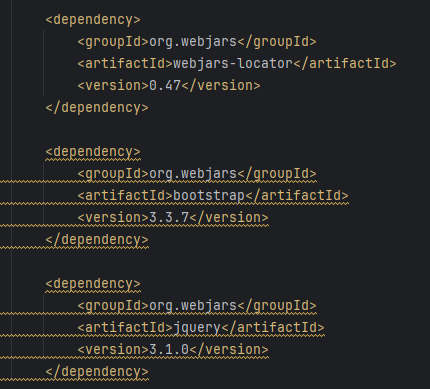

## Front-End - Vistas

1. Se crea el directorio en la ubicación solicitada.

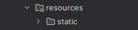

2. Se agrega el index con el codigo para poder representar en front lo pedido en el mock.

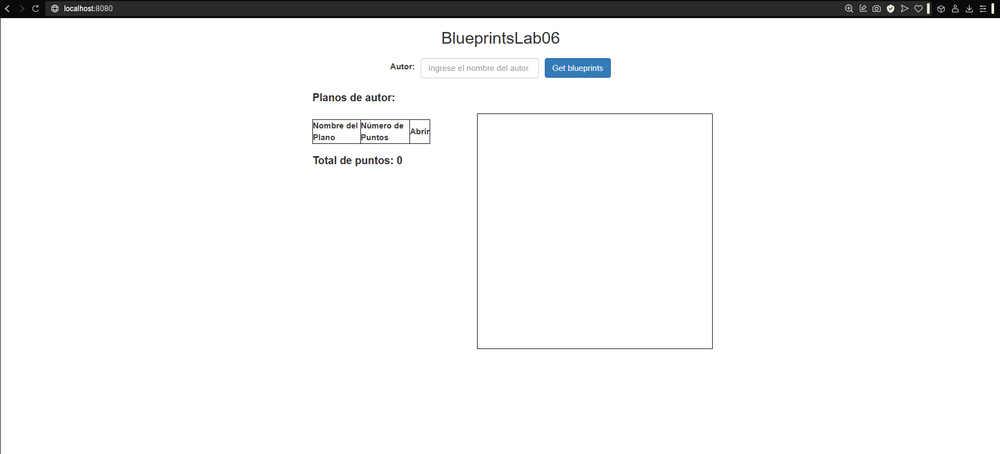

4. Al abrir por localhost:8080 podemos ver que en consola no sale ningun error.

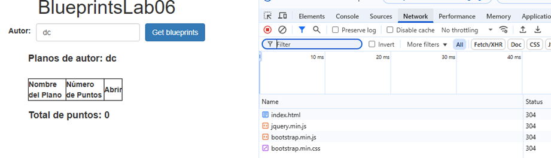

## Front-End - Logica

Para esta parte se creo el apimock como se nos indica
```javascript
const apimock = (function () {
    const mockdata = [];

    mockdata["johnconnor"] = [
        { author: "johnconnor", points: [{ x: 150, y: 120 }, { x: 215, y: 115 }], name: "house" },
        { author: "johnconnor", points: [{ x: 340, y: 240 }, { x: 15, y: 215 }], name: "gear" },
        { author: "johnconnor", points: [{ x: 400, y: 300 }, { x: 200, y: 250 }], name: "bridge" }
    ];

    mockdata["maryweyland"] = [
        { author: "maryweyland", points: [{ x: 140, y: 140 }, { x: 115, y: 115 }], name: "house2" },
        { author: "maryweyland", points: [{ x: 140, y: 140 }, { x: 115, y: 115 }], name: "gear2" },
        { author: "maryweyland", points: [{ x: 220, y: 180 }, { x: 310, y: 170 }], name: "tower" }
    ];

    mockdata["santiagosilva"] = [
        { author: "santiagosilva", points: [{ x: 100, y: 200 }, { x: 150, y: 250 }], name: "roadmap" },
        { author: "santiagosilva", points: [{ x: 50, y: 50 }, { x: 75, y: 80 }], name: "park" },
        { author: "santiagosilva", points: [{ x: 200, y: 220 }, { x: 250, y: 270 }], name: "school" },
        { author: "santiagosilva", points: [{ x: 100, y: 200 }, { x: 200, y: 200 },  { x: 200, y: 300 }, { x: 100, y: 300 }, { x: 100, y: 200 }, { x: 100, y: 200 }, { x: 150, y: 150 }, { x: 200, y: 200 }],name: "House"}
    ];

    mockdata["santiagocordoba"] = [
        { author: "santiagocordoba", points: [{ x: 150, y: 30 }, { x: 120, y: 45}], name: "road" },
        { author: "santiagocordoba", points: [{ x: 180, y: 90 }, { x: 200, y: 120 }], name: "LeBronTheGoat" }
    ];

    return {
        getBlueprintsByAuthor: function (authname, callback) {
            console.log("Buscando planos de:", authname); 
            callback(mockdata[authname] || []);
        },

        getBlueprintsByNameAndAuthor: function (authname, bpname, callback) {
            if (mockdata[authname]) {
                callback(mockdata[authname].find(function (e) { return e.name === bpname }) || null);
            } else {
                callback(null);
            }
        }
    };
})();
```

Tambien se agrego la importación de los dos nuevos modulos.

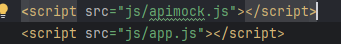

Se agrega de igual manera la funcion para obtener los planos del apimock

```javascript
function getBlueprintsByAuthor(autor) {
        setAuthor(autor);

        api.getBlueprintsByAuthor(autor, function(data) {
            if (!data || data.length === 0) {
                alert("No se encontraron planos para el autor.");
                $("#blueprintsBody").empty();
                $("#totalPoints").text("0");
                $("#blueprintsTable").hide();
                $("#totalContainer").hide();
                $("#blueprintCanvas").hide();
                $("#blueprintName").hide();
                return;
            }

            blueprints = data.map(bp => ({
                name: bp.name,
                points: bp.points
            }));

            $("#selectedAuthor").text(author);
            $("#blueprintsBody").empty();

            blueprints.forEach(bp => {
                $("#blueprintsBody").append(
                    `<tr>
                        <td>${bp.name}</td>
                        <td>${bp.points.length}</td>
                        <td><button class="btn btn-info open-blueprint" data-name="${bp.name}">Abrir</button></td>
                    </tr>`
                );
            });

            let totalPoints = blueprints.reduce((sum, bp) => sum + bp.points.length, 0);
            $("#totalPoints").text(totalPoints);
            $("#blueprintsTable").show();
            $("#totalContainer").show();
        });
    }
```

Prueba de que están cargando de manera correcta los planos.

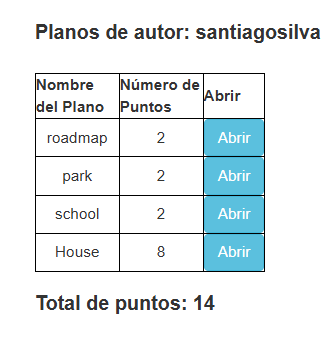

Ahora se procede a añadir la funcion en App.js para poder pintar en el Canvas el plano basado en los puntos.

```javascript
function drawBlueprint(blueprintName) {
        let blueprint = blueprints.find(bp => bp.name === blueprintName);
        if (!blueprint) {
            alert("No se encontraron datos del plano.");
            return;
        }

        let canvas = document.getElementById("blueprintCanvas");
        let ctx = canvas.getContext("2d");

        ctx.clearRect(0, 0, canvas.width, canvas.height);

        if (blueprint.points.length > 1) {
            ctx.beginPath();
            ctx.moveTo(blueprint.points[0].x, blueprint.points[0].y);

            for (let i = 1; i < blueprint.points.length; i++) {
                ctx.lineTo(blueprint.points[i].x, blueprint.points[i].y);
            }

            ctx.strokeStyle = "blue";
            ctx.lineWidth = 2;
            ctx.stroke();
        }

        $("#blueprintName").text(`Plano: ${blueprintName}`).show();
        $("#blueprintCanvas").show();
    }

    $(document).on("click", ".open-blueprint", function () {
        let blueprintName = $(this).data("name");
        drawBlueprint(blueprintName);
    });

    return {
        getBlueprintsByAuthor: getBlueprintsByAuthor
    };
})();
```
Muestra del correcto funcionamiento de la funcion de pintar en el Canvas.


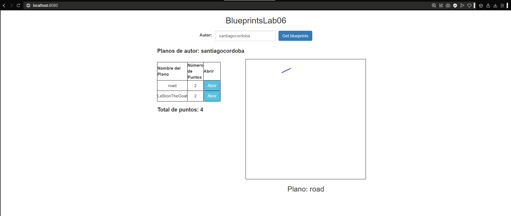

Se añade el módulo de apiclient para poder usar los datos que están almacenados en la persistencia de la API

```javascript
const apiclient = (function () {
    const API_URL = "http://localhost:8080/blueprints";

    return {
        getBlueprintsByAuthor: function (authname, callback) {
            console.log("Obteniendo planos de:", authname);
            $.get(`${API_URL}/${authname}`)
                .done(function (data) {
                    callback(data);
                })
                .fail(function (error) {
                    console.error("Error obteniendo planos del autor:", error);
                    callback([]);
                });
        },

        getBlueprintsByNameAndAuthor: function (authname, bpname, callback) {
            console.log(`Obteniendo plano '${bpname}' del autor '${authname}'`);
            $.get(`${API_URL}/${authname}/${bpname}`)
                .done(function (data) {
                    callback(data);
                })
                .fail(function (error) {
                    console.error("Error obteniendo el plano:", error);
                    callback(null);
                });
        }
    };
})();
```

Por último se modifica App.js para que sea posible cambiar entre apimock y apiclient de manera sencilla.

```javascript
const api = apimock;
```

De esta manera solo cambiando entre cambiar lo asignado a la constante api ya cambiaremos entre consumir apimock y apiclient

Por ultimo cambiamos a consumir el apiclient y se prueba.

```javascript
    const api = apiclient;
```
Estos son los planos existentes en la persistencia.

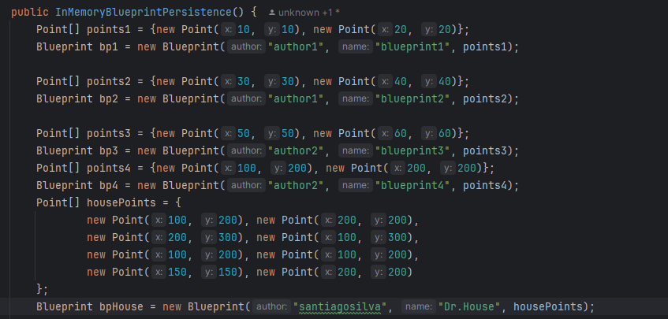

Pruebas de funcionamiento.

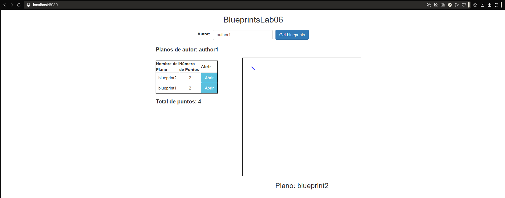

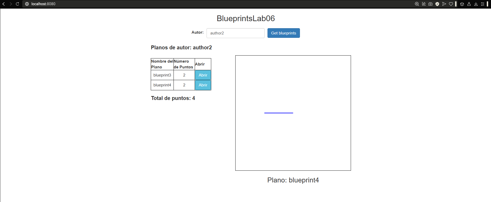

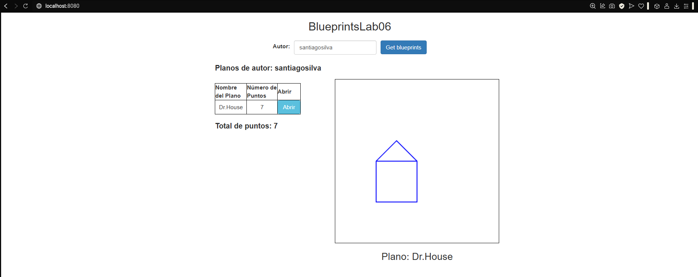