# Lab07-ARSW

### Hecho por:
- Santiago Córdoba Dueñas
- Santiago Silva Roa

## Punto 1

Se agrego al canvas el contar los click que se hacen.

```javascript
function setupCanvasEventListeners() {
        document.getElementById("blueprintCanvas")?.addEventListener("pointerdown", event => {
            if (!currentBlueprintName) return alert("No hay un plano abierto.");
            let rect = event.target.getBoundingClientRect();
            let x = event.clientX - rect.left, y = event.clientY - rect.top;
            blueprints.find(bp => bp.name === currentBlueprintName)?.points.push({ x, y });
            drawBlueprint(currentBlueprintName);
            $("#clickCounter").text(++clickCount);
        });
    }
```


## Punto 2

Se hara una muestra del funcionamiento.

- Plano sin la detección de nuevos puntos sobre el plano:

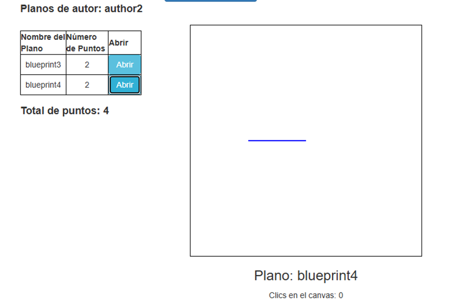

- Se hace un click sobre el canvas.

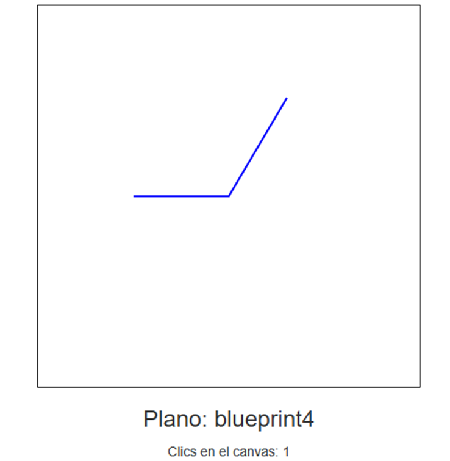

- Despues de dos clicks sobre el canvas.

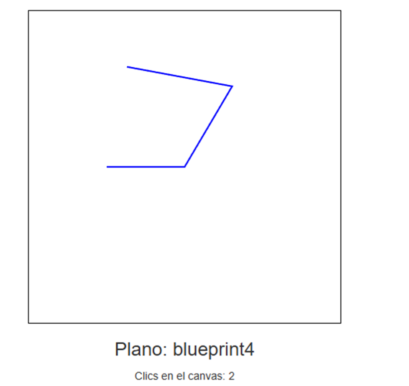

- Despues de n click sobre el canvas.

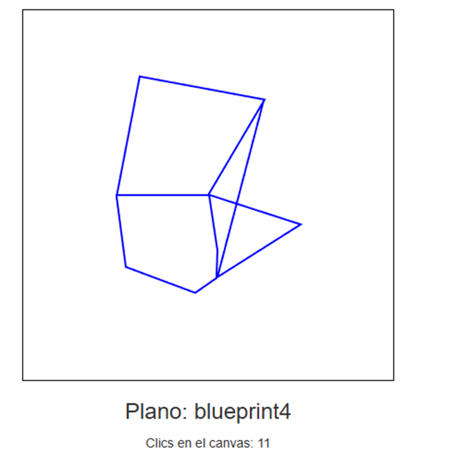

## Punto 3

Muestra del funcionamiento de la funcionalidad save/update.

- Author1 antes de que se cambie el canvas y se use la funcionalidad de save/update.

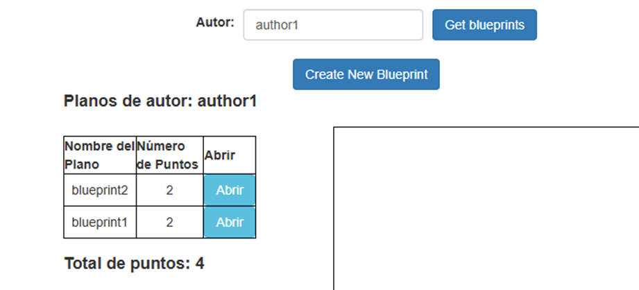

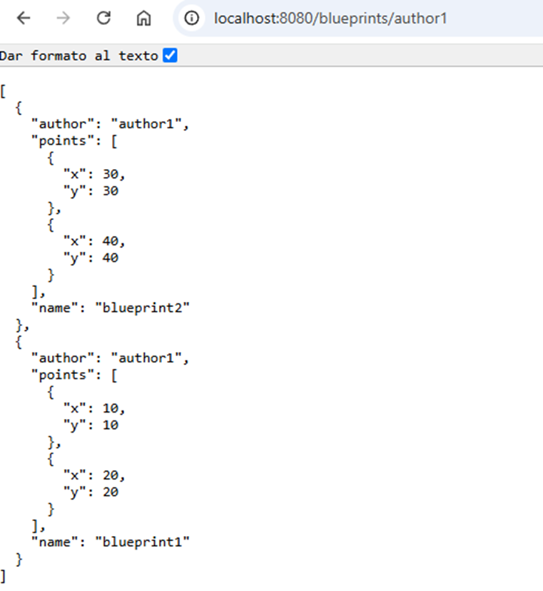

- Estado de los planos del Autho1 despúes de hacer cambios y usar save/update.

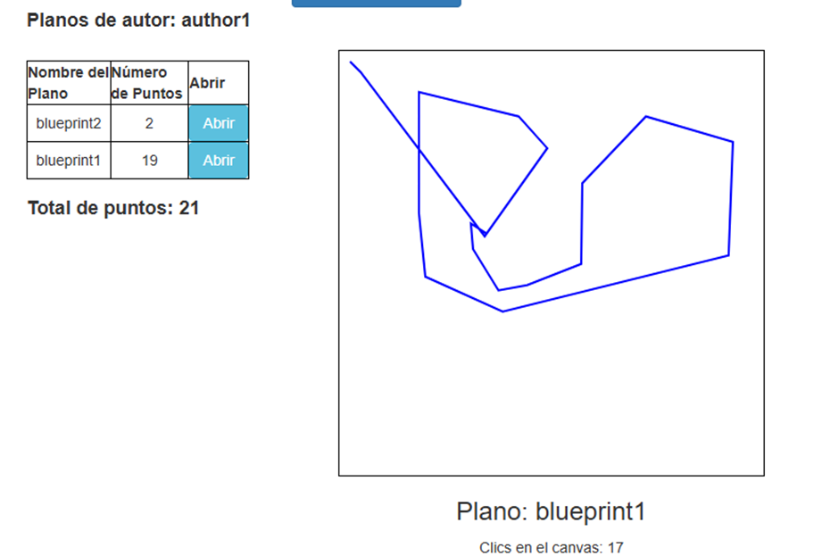

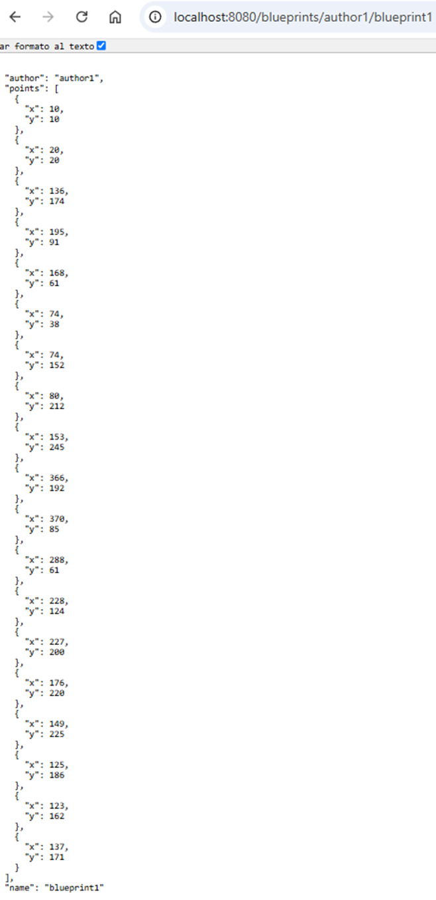

Como se pudo observar se actualiza de manera correcta los planos con los cambios que se esten haciendo.

## Punto 4

Al igual que en los anteriores puntos también se hara la muestra del funcionamiento con un ejemplo.

- Se crea un nuevo plano.

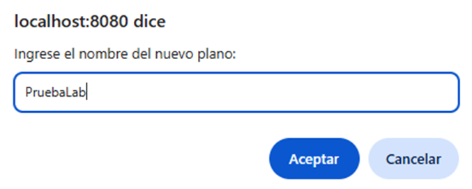

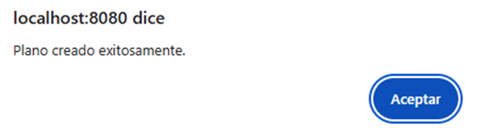

Cuando se crea este plano, se genera una petición POST, que actualiza el número de planos que tiene el usuario, en este
caso Author2 creando asi un nuevo plano sin puntos.

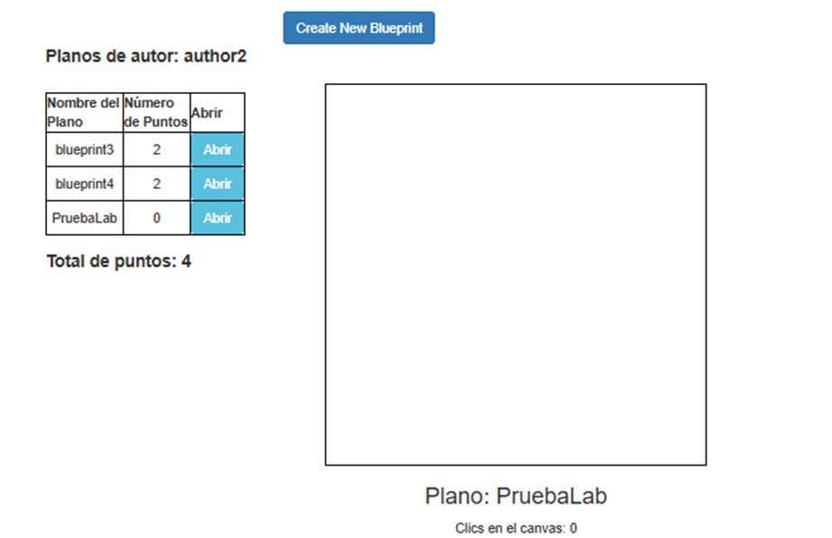

Realizamos clics en el canvas para generar puntos en este y lo guardamos.

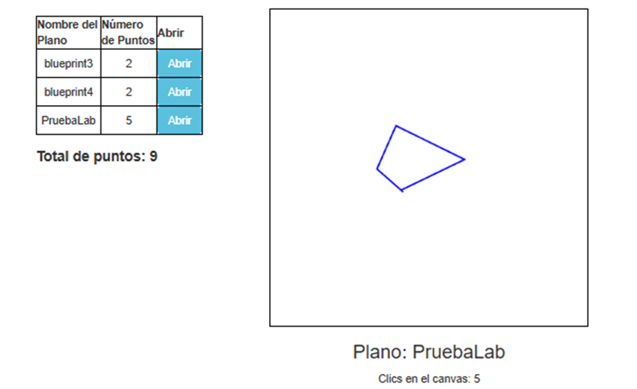

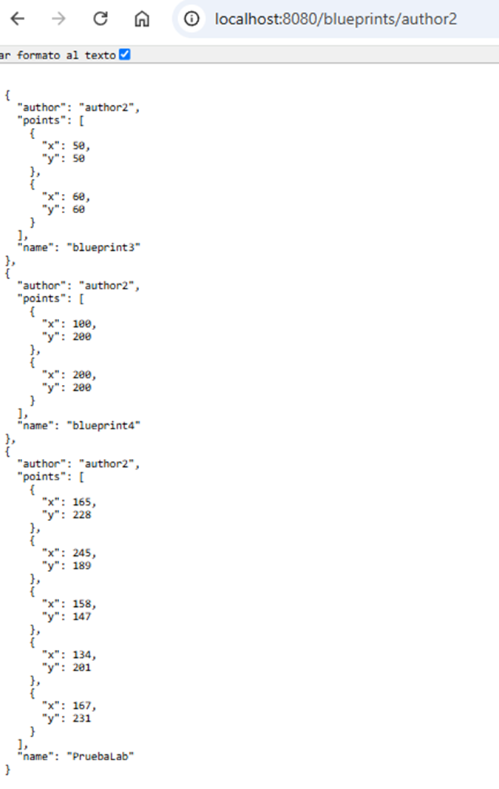

Como se pudo observar se actualiza correctamente los planos de este usuario.

## Punto 5

Se hace un ejemplo para la muestra del funcionamiento de la función delete.

- Eliminaremos el mismo plano que estabamos usando para el ejemplo es decir "PruebaLab".

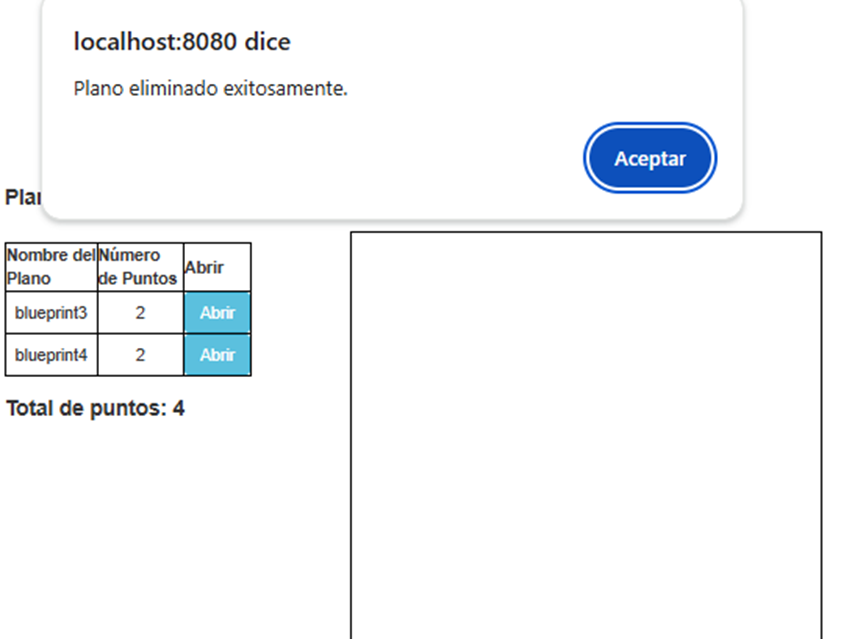

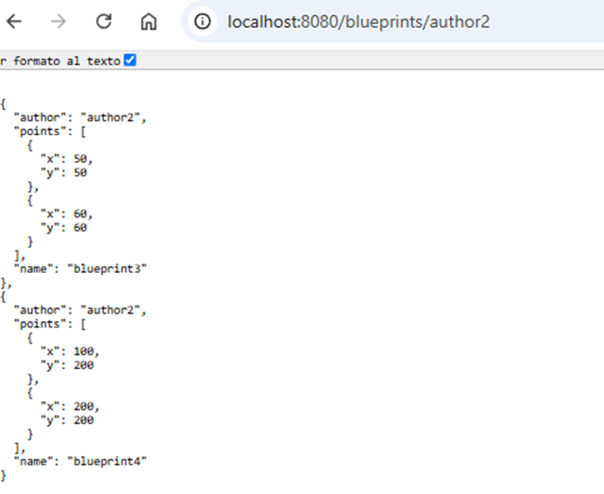

Como se puede ver se elimina correctamente el plano tanto del front como de la persistencia.